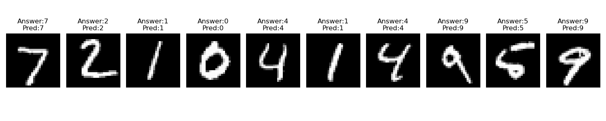

# CNN-based MNIST Classifier (from Scratch)

This repository contains a complete implementation of a Convolutional Neural Network (CNN) for the MNIST handwritten digit classification task, built **from scratch using NumPy** without any high-level deep learning frameworks such as TensorFlow or PyTorch.

The core model is implemented in `deep_cnn.py` using only basic matrix operations and manually coded forward and backward passes.

---

## 🧠 Project Goal

The goal of this project is to:
- Implement a working CNN model without machine learning libraries.
- Understand the forward and backward propagation of CNN layers.
- Build a training loop with mini-batch stochastic optimization.
- Achieve competitive accuracy on the MNIST dataset using our own implementation.

---

## 🗂️ Project Structure

```
├── common/
│   ├── layers.py         # Core CNN/MLP layer implementations (Conv, Pooling, Affine, ReLU, etc.)
│   ├── functions.py      # Activation, loss functions and utility methods
│   ├── optimizer.py      # Implementation of optimizers: SGD, Momentum, Adam, etc.
│   ├── trainer.py        # Generic Trainer class handling epochs, batching, and logging
│   └── load_dataset.py   # MNIST dataset loader
│
├── deep_cnn.py           # Main CNN model class (Simple CNN version)
├── train_deep_cnn.py     # Training script for the CNN model
├── prediction_results.png  # ⬅️ Visualization of model predictions (example output)
└── README.md             # Project description (this file)
```
---

## Model Architecture
The model follows a CNN structure, using two convolutional-pooling blocks followed by two affine (fully connected) layers.

```
Input: (1 x 28 x 28) grayscale image

→ Conv2D (16 filters, 3x3, stride=1, pad=1)
→ ReLU
→ MaxPool2D (2x2)

→ Conv2D (32 filters, 3x3, stride=1, pad=1)
→ ReLU
→ MaxPool2D (2x2)

→ Flatten (32 x 7 x 7)
→ Affine (dense) layer (output: 100 units)
→ ReLU
→ Affine (dense) layer (output: 10 units)
→ Softmax + Cross Entropy Loss
```

### He Initialization
To ensure stable learning, **He Initialization** is used for all convolutional and affine layers. This technique is specifically suited for ReLU activations and helps mitigate vanishing/exploding gradients by scaling weights based on the number of input units:

$$W \sim \mathcal{N}\left(0, \frac{2}{n_{\text{in}}}\right)$$

Where $n_{\text{in}}$ is the number of input connections (fan-in) to the neuron.

For example:
- A conv layer with 16 filters of size $3 \times 3$ and 1 input channel uses fan-in $1 \times 3 \times 3 = 9$, so the weights are sampled as:
```python
W = np.random.randn(16, 1, 3, 3) * np.sqrt(2.0 / 9)
```

This helps maintain signal variance through layers and accelerates convergence.

---

## Training
The training is handled by the `Trainer` class in `common/trainer.py`, which performs:
- Mini-batch gradient descent
- Accuracy evaluation per epoch
- Parameter updates via configurable optimizer (SGD, Adam, Momentum; Adam is used here)

The model can be trained by using the code `train_deep_cnn.py`.

By default, it:
- Trains on the full 60,000 MNIST training images
- Uses the **Adam optimizer** with a learning rate of 0.001
- Evaluates accuracy on 1,000 test samples per epoch
- Runs for 5 epochs
  
Dataset size, optimizer, learning rate, and number of epochs can be customized inside `train_deep_cnn.py`.

---

## Prediction and Visualization
After training, the model parameters are saved as a `.pkl` file. This allows us to reload the model and visualize its predictions on test samples.

### Example Prediction Output
Below is an example of predictions on 10 MNIST test images:

Each image shows the answer label and the model's prediction (Pred) for easy comparison.

### Saving and Loading Parameters
The model includes methods to save and load trained parameters:
```{python}
# Save after training
network.save_params("DeepCNN_params_fast_test.pkl")

# Load for later use
network.load_params("DeepCNN_params_fast_test.pkl")
```

This allows for quick reuse of trained models without retraining from scratch.

### Accuracy Example
With just 5 epochs of training, the model reached about 97% accuracy.

This performace can be improved further with:
- More epochs
- Full training set
- Regularization

---

## Notes
- This code does **not** rely on any deep learning library.
- Every CNN layer is implemented manually, including convolution, pooling, affine transforms, and ReLU.
- Optimizers are also hand-coded in `common/optimizer.py`.

---

## `common` Folder Overview
The `common/` directory contains core building blocks of the neural network, all implemented from scratch:

| File | Description |
|---|---|
| `layers.py` | Implements core layers: `Convolution`, `Affine`, `ReLU`, `Pooling`, `SoftmaxWithLoss`, etc. Each supports forward and backward passes for backpropagation. |
| `functions.py` | Utility functions for activations (e.g., `softmax`, `sigmoid`), loss computations (`cross_entropy_error`), and numerical gradient checks. |
| `optimizer.py` | Optimizers such as SGD, Momentum, AdaGrad, RMSProp, and Adam. These directly update parameters via in-place operations. |
| `trainer.py` | A `Trainer` class that abstracts the training loop: mini-batch creation, evaluation, optimizer updates, and logging. |
| `load_dataset.py` | Functions to load and preprocess MNIST or CIFAR-10 data using Keras. Includes options for flattening, normalization, and one-hot encoding. |
